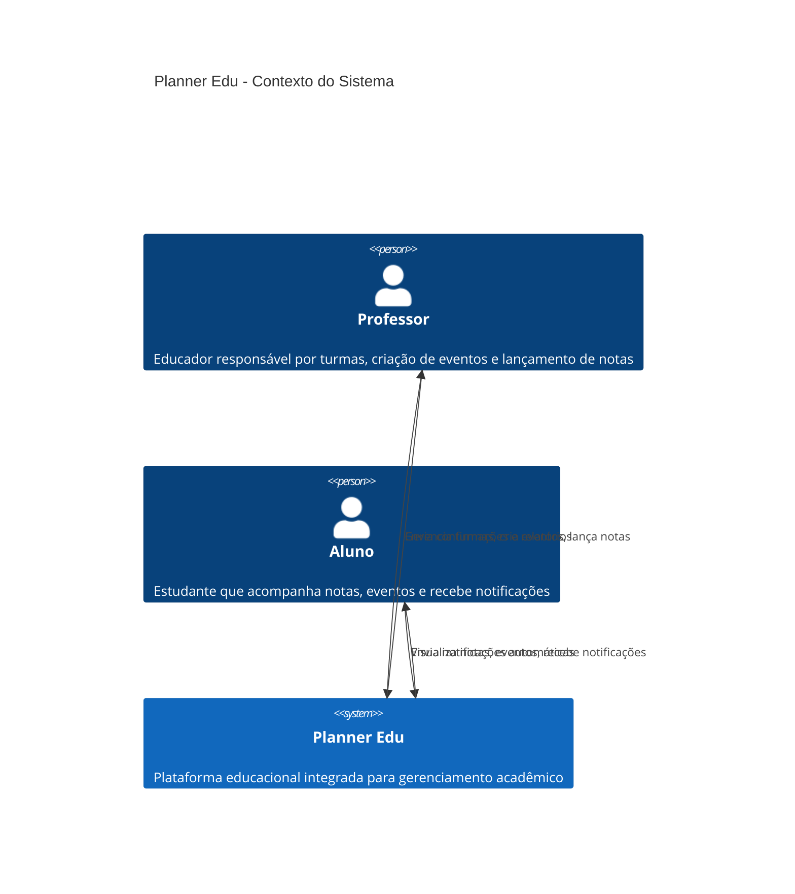
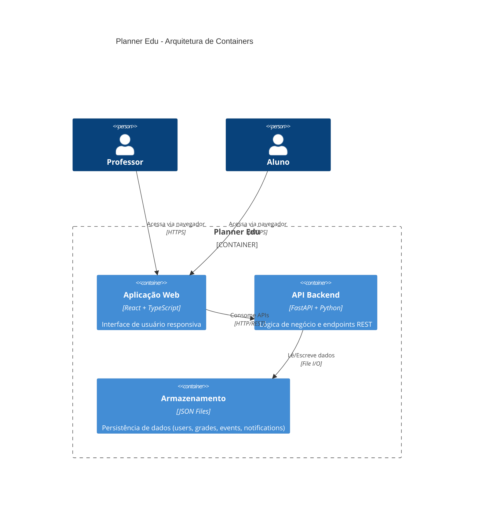
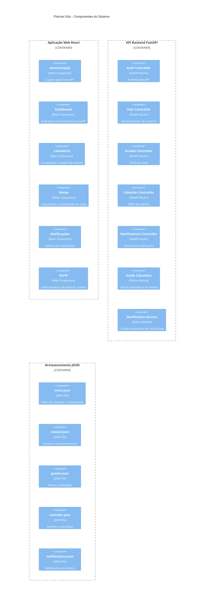
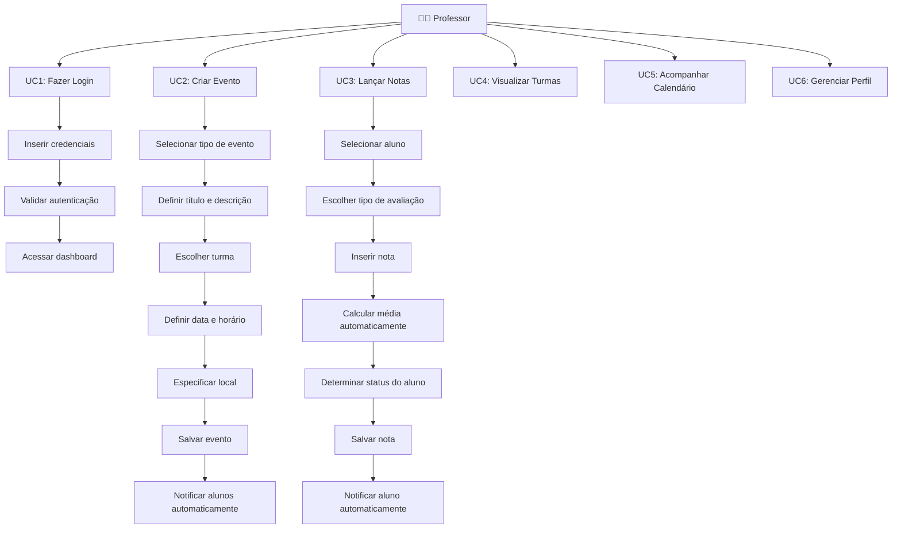
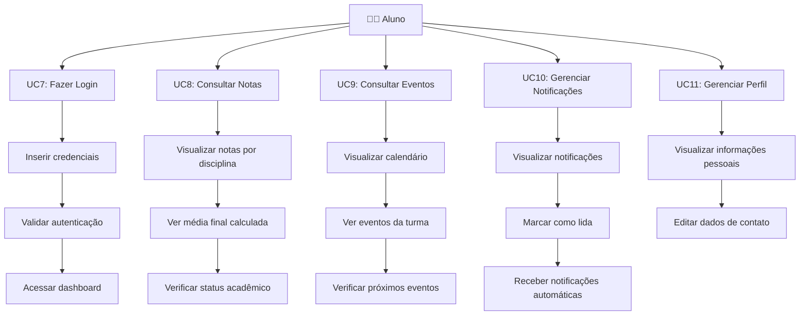
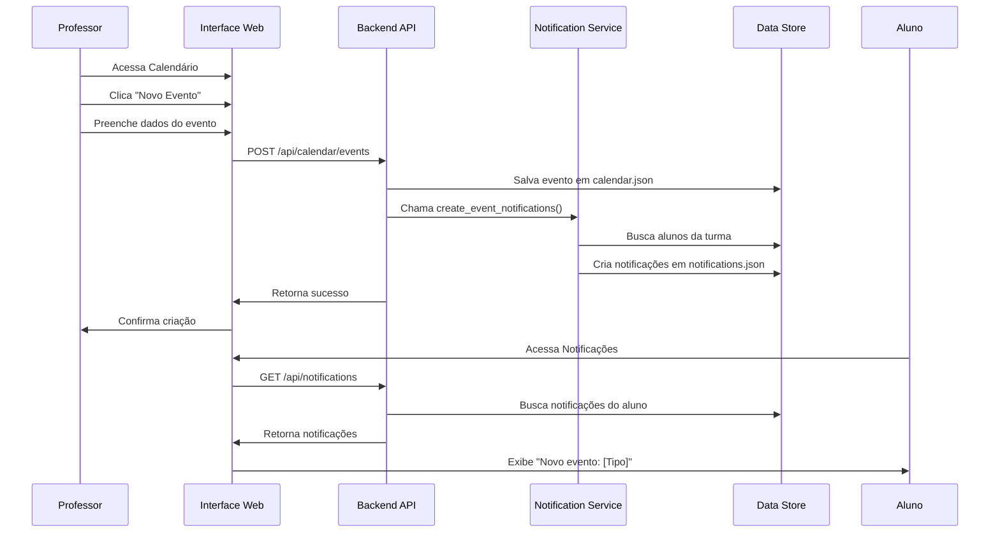
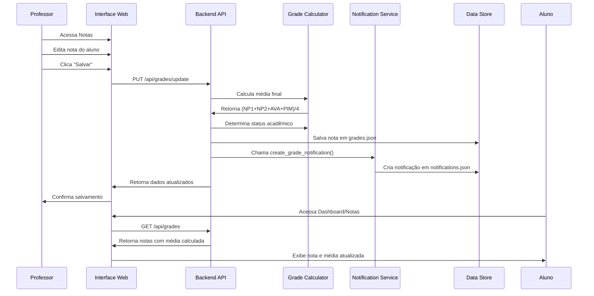
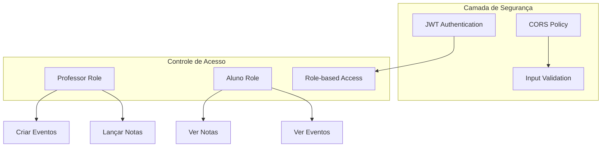

# Planner Edu - Arquitetura C4 e Casos de Uso

## Visão Geral do Sistema

O **Planner Edu** é uma plataforma educacional integrada que facilita o gerenciamento acadêmico entre professores e alunos através de funcionalidades de planejamento, avaliação e comunicação.

## Diagrama C4 - Nível 1: Contexto do Sistema



## Diagrama C4 - Nível 2: Container



## Diagrama C4 - Nível 3: Componentes



## Casos de Uso Detalhados

### 1. Casos de Uso do Professor



### 2. Casos de Uso do Aluno



### 3. Casos de Uso do Sistema

```mermaid
graph TD
    Sistema[🖥️ Sistema]
    
    %% Notificações Automáticas
    Sistema --> UC12[UC12: Gerar Notificações Automáticas]
    UC12 --> UC12_1[Detectar lançamento de nota]
    UC12_1 --> UC12_2[Criar notificação para aluno]
    UC12_2 --> UC12_3[Detectar criação de evento]
    UC12_3 --> UC12_4[Notificar alunos da turma]
    
    %% Cálculos Automáticos
    Sistema --> UC13[UC13: Calcular Médias]
    UC13 --> UC13_1[Aplicar fórmula: (NP1+NP2+AVA+PIM)/4]
    UC13_1 --> UC13_2[Determinar status: Aprovado/Recuperação/Reprovado]
    
    %% Gerenciamento de Dados
    Sistema --> UC14[UC14: Reset de Dados]
    UC14 --> UC14_1[Detectar reinicialização]
    UC14_1 --> UC14_2[Restaurar dados iniciais limpos]
    UC14_2 --> UC14_3[Garantir ambiente de teste consistente]
```

## Fluxos de Integração

### Fluxo: Professor Cria Evento → Aluno Recebe Notificação



### Fluxo: Professor Lança Nota → Cálculo Automático → Notificação



## Arquitetura de Segurança



## Tecnologias e Padrões Utilizados

### Frontend
- **React 18** - Framework de interface
- **TypeScript** - Tipagem estática
- **Tailwind CSS** - Estilização
- **React Hook Form** - Gerenciamento de formulários
- **Lucide React** - Ícones
- **React Hot Toast** - Notificações de UI

### Backend
- **FastAPI** - Framework web Python
- **JWT** - Autenticação
- **Pydantic** - Validação de dados
- **Uvicorn** - Servidor ASGI

### Padrões Arquiteturais
- **REST API** - Comunicação cliente-servidor
- **Component-based Architecture** - Frontend modular
- **MVC Pattern** - Separação de responsabilidades
- **Observer Pattern** - Sistema de notificações
- **Strategy Pattern** - Cálculo de notas por tipo

## Métricas do Sistema

### Funcionalidades Implementadas
- ✅ **5 Páginas principais** (Dashboard, Calendário, Notas, Notificações, Perfil)
- ✅ **2 Perfis de usuário** (Professor, Aluno)
- ✅ **8 Endpoints REST** principais
- ✅ **4 Tipos de avaliação** (NP1, NP2, AVA, PIM)
- ✅ **4 Tipos de evento** (Aula, Prova, Trabalho, Projeto)
- ✅ **Sistema de notificações** automáticas
- ✅ **Cálculo automático** de médias
- ✅ **Reset automático** de dados

### Qualidade do Código
- ✅ **TypeScript** para tipagem segura
- ✅ **Componentes reutilizáveis**
- ✅ **Validação de entrada** em formulários
- ✅ **Tratamento de erros** consistente
- ✅ **Interface responsiva**
- ✅ **Código limpo** e bem documentado
